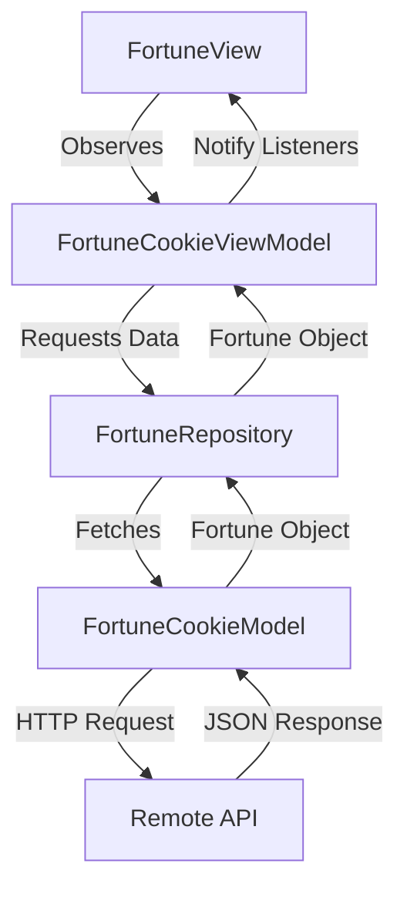

# 🥠 Fortune Cookie App

A professional Flutter demonstration app that fetches and displays mystical fortunes from a remote API. This project is designed to showcase a clean, scalable architecture and a polished user experience.

## 🚀 Features

- **Dynamic Fortune Fetching**: Real-time integration with the ApiVerve Fortune Cookie API.
- **State-Driven UI**: Seamless transitions between Loading, Success, and Error states.
- **Professional Design**: 
  - Custom Global Theme with a "Fortune" palette (Gold, Deep Red, and Cream).
  - Elegant typography using `Google Fonts`.
  - Immersive loading experience with **Lottie Animations**.
- **Robust Architecture**: Implements the MVVM pattern for maximum maintainability.
- **Mock Mode**: Built-in toggle to use mock data for offline development and testing.

## 🏗️ Architecture (MVVM)

This app follows the **Model-View-ViewModel** pattern to ensure a strict separation of concerns:



### Layer Breakdown:
- **View**: Purely declarative UI. It listens to the ViewModel and renders the state (Loading $\rightarrow$ Fortune $\rightarrow$ Error).
- **ViewModel**: The "Brain" of the app. It manages the UI state (`isLoading`, `fortune`, `error`) and coordinates data fetching.
- **Repository**: A mediation layer that abstracts the data source. It allows the app to switch between `ApiFortuneRepository` and `MockFortuneRepository` without affecting the ViewModel.
- **Model**: Handles the low-level HTTP communication and JSON deserialization.

## 🛠️ Tech Stack

- **Framework**: [Flutter](https://flutter.dev)
- **State Management**: [Provider](https://pub.dev/packages/provider) (Dependency Injection & State)
- **Animations**: [Lottie](https://pub.dev/packages/lottie)
- **Typography**: [Google Fonts](https://pub.dev/packages/google_fonts)
- **Networking**: [HTTP](https://pub.dev/packages/http)
- **Configuration**: [Flutter DotEnv](https://pub.dev/packages/flutter_dotenv)

## ⚙️ Setup & Installation

1. **Clone the repository**:
   ```bash
   git clone https://github.com/yourusername/fc_app.git
   cd fc_app
   ```

2. **Install dependencies**:
   ```bash
   flutter pub get
   ```

3. **Configure Environment**:
   Create a `.env` file in the root directory:
   ```text
   API_KEY=your_apiverve_api_key_here
   ```

4. **Run the app**:
   ```bash
   flutter run
   ```

## 📁 Project Structure

```text
lib/
├── theme/
│   └── app_theme.dart          # Global design system (Colors, Fonts, Button styles)
├── model/
│   └── fortune_cookie_model.dart # API communication & JSON parsing
├── repositories/
│   └── fortune_repository.dart   # Data abstraction (API vs Mock)
├── viewModel/
│   └── fortune_cookie_view_model.dart # Business logic & State management
├── views/
│   ├── fortune_view.dart       # Main screen (State-driven)
│   └── widgets/
│       ├── fortune_page.dart   # Fortune display layout
│       ├── fortune_widget.dart # The "Parchment" fortune card
│       └── error_state.dart    # Professional error handling UI
└── utils/
    └── fortune_cookie.dart     # Data models (Fortune, FortuneCookie)
```

## 🌟 Key Engineering Decisions

- **Dependency Injection**: Used `Provider` to inject the ViewModel, removing tight coupling and enabling easier testing.
- **Post-Frame Callbacks**: Implemented `WidgetsBinding.instance.addPostFrameCallback` to prevent "setState() called during build" errors.
- **Custom Theme**: Centralized all styling in `AppTheme` to ensure visual consistency and easy maintenance.
- **Error Mapping**: Implemented a dedicated `ErrorState` widget with a retry mechanism to improve User Experience (UX).

- `fetchCookie()` to refresh data

### `lib/model/fortune_cookie_model.dart`

Performs the HTTP GET request and decodes JSON into model objects.

### `lib/fortune_cookie.dart`

Defines:

- `FortuneCookie`
- `Fortune`

and factory constructors that parse the JSON response.

## Running the app

From the project root:

```bash
flutter pub get
flutter run
```

If you make changes to the startup state or the API request, do a full restart instead of hot reload.

## Customization

### Change the API key

Update the header value in `lib/model/fortune_cookie_model.dart`.

### Change the API endpoint

Update the URI in `lib/model/fortune_cookie_model.dart`.

### Display more fields

Extend `Fortune` and the UI widgets if the API returns additional data.

## Notes

- The current implementation uses a single `ChangeNotifier` and no additional state management package.
- For a production app, consider moving the API key into a secure configuration or environment variable.
- The app currently shows a placeholder fallback message when the state is unexpected.
